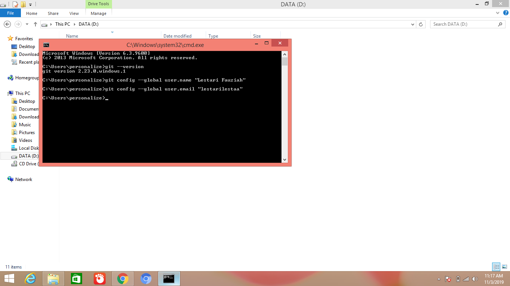
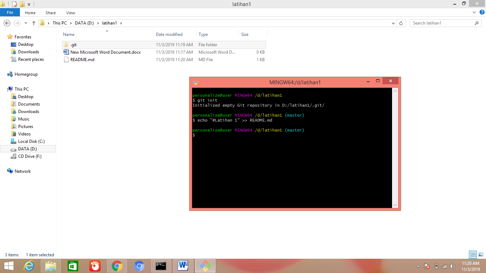
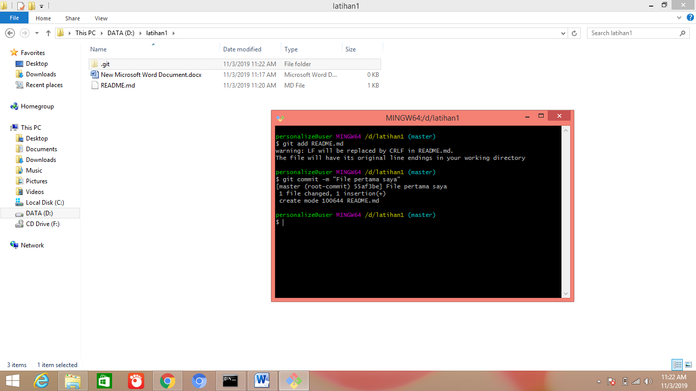
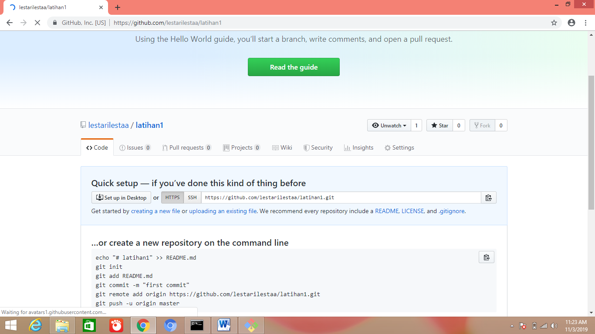
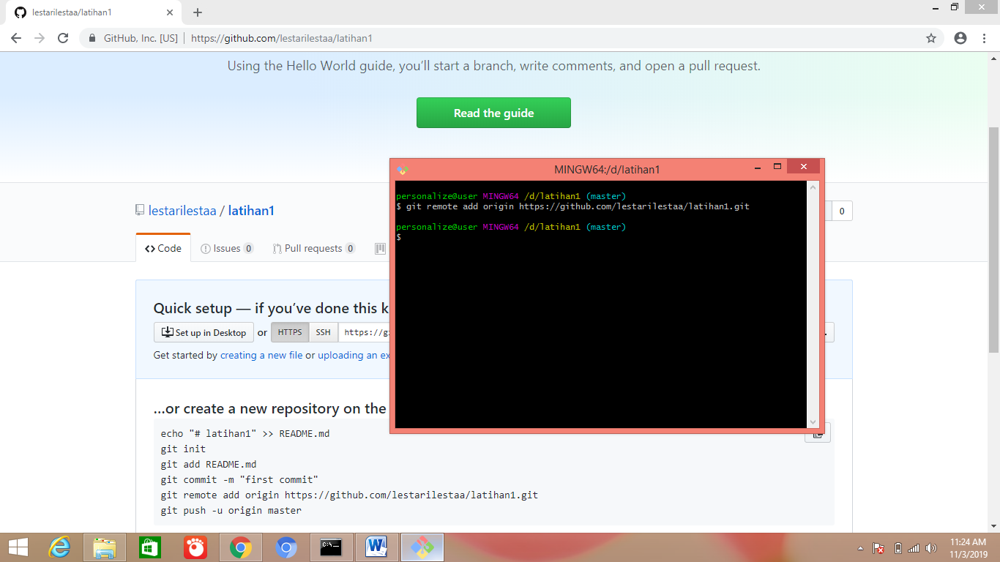
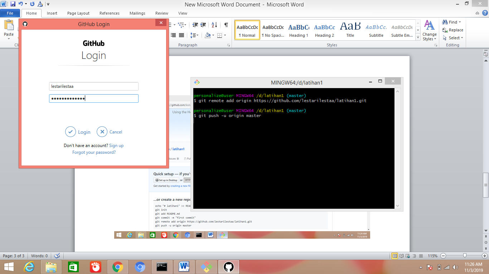
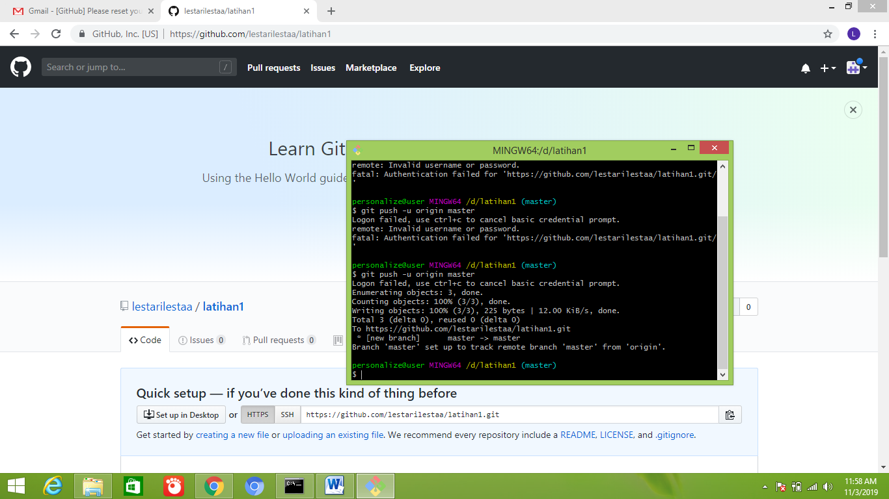
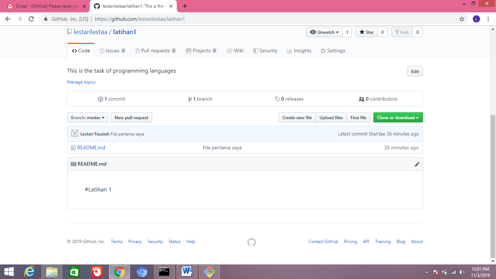

# Cara Menggunakan Git

1.Download git 
2.Install Git 
3.Cek versi Git 
4.Lakukan konfigurasi Username dan Email Git 
5.Buat folder di windows explorer dengan nama "latihan1" 
6.Klik kanan folder tersebut lalu pilih git bash 
7.Masukan perintah git init, untuk membuat repository lokal 
8.Buat file README.md 
9.Buka git bash lagi, masukan perintah "git add README.md" 
10.Masukan perintah "git commit -m "File pertama saya" 
11.Buka github.com, login. 
12.Buat repository dengan nama "latihan1" 
13.Copy URL tersebut, buka git bash lagi. 
14.Masukan perintah git remote add origin URL. 
15.Kemudian "git push -u origin master". 
16.Masukan username dan password github anda. 
17.Dan refresh repository github anda. 
18.File README.md berhasil di Upload. 

